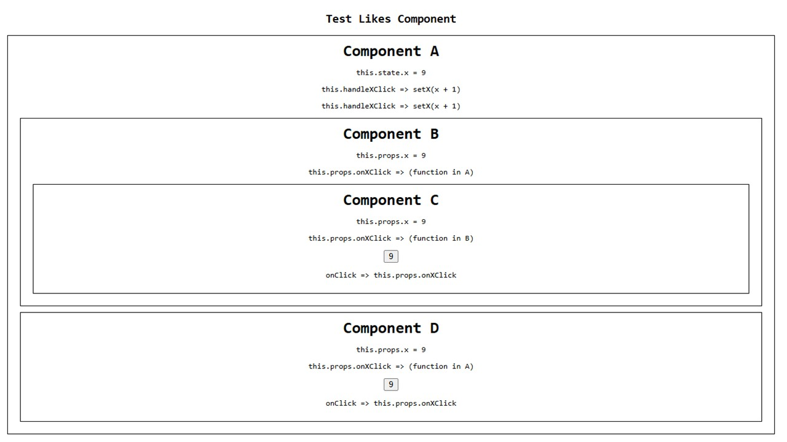

# Parent-Child State Management in React

This project was originally designed for a Likes component (Likes.jsx), but to save time, a single-file alternative (ParentChild.jsx) was created in the same project instead of starting a new Vite setup.

## Overview
This project illustrates state lifting in React by centralizing state in a parent component (A) and passing it to childs (B,C,D) components via props, ensuring a unidirectional data flow.

## Browser output

## Project Structure
my-likes-app/  
│── src/  
│   ├── App.jsx          # Root component rendering ParentChild  
│   ├── ParentChild.jsx  # Contains Parent and Child components  
│   ├── Likes.jsx        # Standalone Likes component (original implementation)  
│   ├── index.css        # Styling (if applicable)  
│   ├── main.jsx         # Entry point  

## Why State Lifting?
- Avoids redundant state duplication.
- Ensures consistent data synchronization.
- Enhances code reusability and separation of concerns.

## Running the Project
- Clone the repository:                     git clone https://github.com/yourusername/my-likes-app.git
- Navigate to the project directory:        cd my-likes-app
- Install dependencies:                     npm install
- Start the development server:             npm run dev

[React useState Practice Exercises](https://www.clientside.dev/blog/react-use-state-practice-exercises)

## Reference
